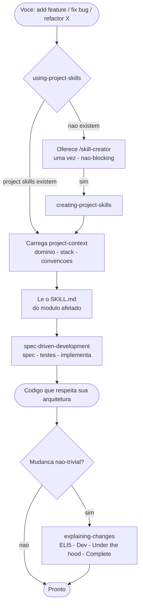
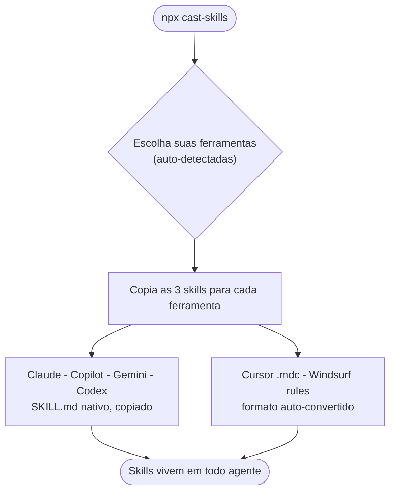
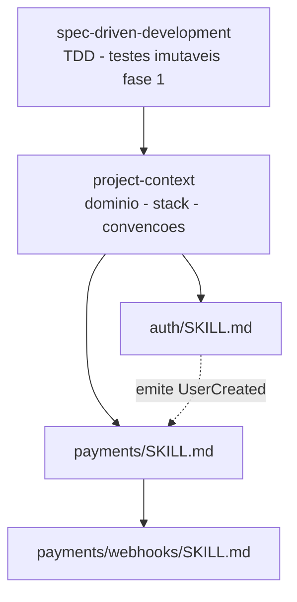

<div align="center">

# cast-skills

### Uma instalacao. Todas as ferramentas de IA. Skills que entendem o *seu* projeto.

Crie uma base de conhecimento viva — contexto do projeto, regras de negocio por modulo e
um workflow TDD spec-driven — e roteie **toda** feature, fix e refactor por ela.

[](https://www.npmjs.com/package/cast-skills)
[](https://nodejs.org)
[](#-licenca)
[](https://agentskills.io)
[](#%EF%B8%8F-ferramentas-suportadas)

```bash
npx cast-skills
```

</div>

---

## O problema

Seu agente de IA re-aprende seu codebase **toda sessao**. Esquece suas convencoes, os
limites dos modulos, qual servico emite qual evento, aquela regra de "todo usuario precisa
pertencer a uma organizacao" que nao esta em nenhum arquivo. Ai ele deriva. Voce re-explica.
Ele reescreve.

`cast-skills` resolve isso transformando o conhecimento tribal do seu projeto em **skills** —
o padrao aberto [`SKILL.md`](https://agentskills.io) que **20+ ferramentas de IA leem nativamente**.
Escreva uma vez; todo agente usa.

> Progressive-disclosure skills cortam uso medio de tokens em **~40%** e aumentam acuracia
> em **~15-20%** vs. jogar tudo num prompt so. *(Anthropic, Agent Skills engineering.)*
> cast-skills e construido nesse padrao de ponta a ponta.

---

## O que voce ganha

Tres skills cross-tool, instaladas uma vez:

| Skill | Papel |
|-------|-------|
| **`using-project-skills`** | **Roteador always-on.** Dispara quando voce comeca uma feature/fix/refactor — carrega o contexto do projeto e direciona o trabalho pelo modulo certo + workflow spec-driven. Nao tem project skills ainda? Oferece criar (uma vez, sem encher o saco). |
| **`creating-project-skills`** | **O bootstrapper** (`/skill-creator`). Le seu codebase, faz umas perguntas certeiras e gera toda a arvore de skills do projeto. |
| **`explaining-changes`** | **O professor.** Apos uma mudanca nao-trivial, oferece uma explicacao beginner-first na profundidade que *voce* escolher — ELI5, dev, ou ate compilacao & runtime — salva como Markdown (e opcionalmente HTML) com diagramas, analogias e referencias. |

---

## Como as 3 skills se comunicam

As skills formam um pipeline conectado. Nenhuma funciona isolada — cada uma tem seu momento:



### O fluxo resumido

1. **`using-project-skills`** (roteador) — detecta que voce comecou a trabalhar. Verifica se
   `skills/project-context/` e `skills/spec-driven-development/` existem.
   - **Se sim**: carrega contexto do projeto, identifica o modulo, le o `SKILL.md` do modulo e
     entrega pro workflow spec-driven.
   - **Se nao**: oferece rodar `/skill-creator` (uma vez por sessao). Se voce aceitar,
     `creating-project-skills` entra em acao.

2. **`creating-project-skills`** (bootstrapper) — le o codebase inteiro, entrevista voce sobre
   o dominio e regras de negocio nao-obvias, e gera:
   - `skills/project-context/SKILL.md` — mapa geral (dominio, stack, convencoes, tabela de modulos)
   - `skills/spec-driven-development/` — workflow TDD adaptado ao seu stack
   - `<modulo>/SKILL.md` por modulo — responsabilidades, regras de negocio, emits/consumes/depends-on

3. **`explaining-changes`** (professor) — acionada pelo roteador apos trabalho nao-trivial (2+
   arquivos, conceito novo, logica nao-obvia). Oferece explicacao na profundidade que voce quiser.
   Salva em `explanations/` (gitignored).

### Beneficios da comunicacao

- **Zero re-explicacao**: o agente carrega contexto do projeto + modulo antes de tocar codigo.
  Sem "me lembra qual e a regra de tenant isolation?"
- **Consistencia arquitetural**: spec-driven garante spec primeiro, testes imutaveis depois,
  implementacao por ultimo. Sem drift.
- **Aprendizado acumulativo**: explaining-changes cria documentacao de estudo que persiste entre
  sessoes. Voce entende o que foi feito, nao so o diff.
- **Onboarding instantaneo**: novo membro do time roda `/skill-creator`, o projeto inteiro
  vira skills navegaveis.

---

## Instalar

```bash
npx cast-skills          # roda o wizard, sem instalar globalmente
# ou
npm i -g cast-skills && cast-skills
```

Um wizard bonito no terminal (feito com [`@clack/prompts`](https://www.npmjs.com/package/@clack/prompts))
auto-detecta quais ferramentas voce ja usa, deixa voce escolher o escopo, e coloca as skills no
lugar certo.



---

## Ferramentas suportadas

| Ferramenta | Destino | Formato |
|------------|---------|---------|
| Claude Code | `~/.claude/skills/` | nativo `SKILL.md` |
| GitHub Copilot | `~/.copilot/skills/` | nativo |
| Gemini CLI | `~/.gemini/skills/` | nativo |
| Codex / universal | `~/.agents/skills/` | nativo |
| Cursor | `.cursor/skills/` *(projeto)* | auto-convertido `.mdc` |
| Windsurf | `.windsurf/rules/` *(projeto)* | auto-convertida |

Como skills sao `SKILL.md` puro, **qualquer** agente que fala o padrao auto-detecta pela
`description` — nao e so pra Claude.

---

## O que e gerado no seu projeto

```
skills/
├── project-context/SKILL.md          # o mapa: dominio, stack, padroes, tabela de modulos
└── spec-driven-development/
    ├── SKILL.md                       # workflow 4 fases, adaptado ao SEU stack
    └── references/                    # engine spec-driven completo + convencoes + regras TDD
src/
└── <modulo>/
    ├── SKILL.md                       # regras + relacionamentos (emits / consumes / depends-on)
    └── <submodulo>/SKILL.md           # detalhe mais fundo, so onde vale a pena
```

Esses arquivos formam um grafo que o agente navega top-down — contexto primeiro, depois o modulo,
depois o trabalho:



Commite esses arquivos no repo. Sao documentacao viva que todo agente le de graca.

---

## Feature principal: TDD imutavel

O skill `spec-driven-development` gerado impoe uma regra dura:

> **Fase 1 — voce escreve os testes. Eles sao o contrato congelado.**
> **Fase 2 — a implementacao se conforma aos testes. Voce nunca edita um teste pra fazer o codigo passar.**

Se um teste parece errado, isso e uma *mudanca de spec* — voce para, corrige a spec, e revisa
o teste deliberadamente. O teste segue a spec, nunca a implementacao. Sem mover as traves
silenciosamente pra ficar verde.

---

## Entenda tudo que voce envia

Codigo funcionando que voce nao entende e um passivo. Apos qualquer mudanca nao-trivial,
`explaining-changes` oferece um walkthrough na profundidade que voce tiver energia naquele dia —
e salva (gitignored) pra voce revisitar depois.

| Nivel | Voce recebe |
|-------|-------------|
| **1 - ELI5** | O que e por que, uma analogia forte, zero jargao |
| **2 - Dev** | Fluxo de dados, decisoes de design, trade-offs, code walkthrough |
| **3 - Under the hood** | Compilacao, runtime, memoria, complexidade, o que o framework esconde |
| **4 - Complete** | Um doc que sobe de ELI5 ate o metal |

Todo arquivo vem com uma analogia central, diagramas Mermaid, um glossario e **referencias reais** —
e opcionalmente uma pagina HTML self-contained que renderiza os diagramas no navegador. Explicacoes
sao escritas pra um iniciante curioso: todo termo definido, nada mao-wavado.

---

## Duas formas de instalar

- **npm (principal):** `npx cast-skills` — funciona pra toda ferramenta suportada.
- **Plugin Claude Code:** o repo inclui manifesto `.claude-plugin/`, entao voce tambem pode
  instalar como plugin do Claude Code.

---

## Atribuicao

O workflow `spec-driven-development` e derivado do **tlc-spec-driven** (Tech Lead's Club —
Spec-Driven Development) por **Felipe Rodrigues** ([@felipfr](https://github.com/felipfr)),
licenciado **CC-BY-4.0**. cast-skills inclui ele na integra e adiciona convencoes especificas
do projeto mais a regra de TDD imutavel. Autoria e licenca originais preservadas.

## Licenca

MIT — para CLI e skills originais. Conteudo tlc-spec-driven bundled permanece CC-BY-4.0.

<div align="center">
<sub>Feito pra quem cansou de explicar o proprio codebase pra um robo toda manha.</sub>
</div>
