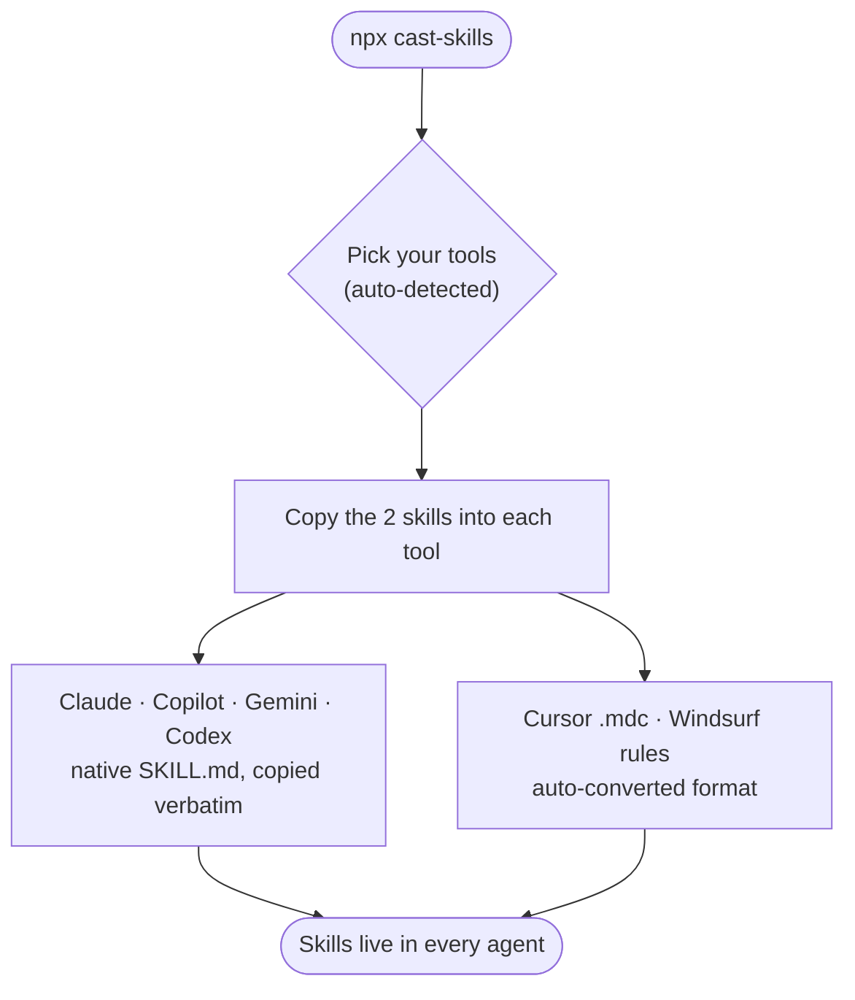
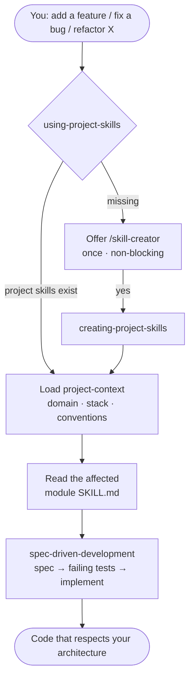
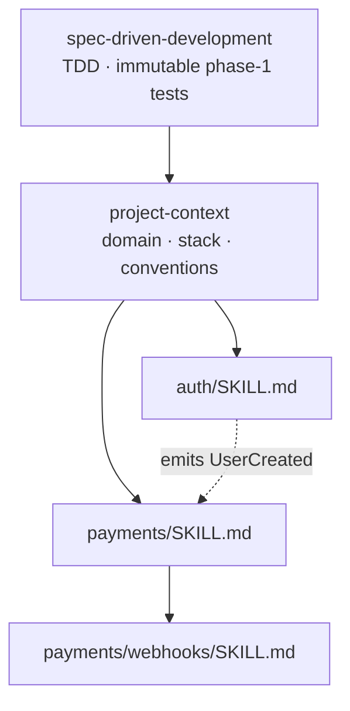

<div align="center">

# 🎯 cast-skills

### One install. Every AI tool. Skills that actually understand *your* project.

Bootstrap a living knowledge base — project context, per-module business rules, and a
TDD spec-driven workflow — then route **every** feature, fix, and refactor through it.

[](https://www.npmjs.com/package/cast-skills)
[](https://nodejs.org)
[](#-license)
[](https://agentskills.io)
[](#%EF%B8%8F-supported-tools)

```bash
npx cast-skills
```

</div>

---

## 🤔 The problem

Your AI coding agent re-learns your codebase **every single session**. It forgets your
conventions, your module boundaries, which service emits which event, that "every user must
belong to an org" rule that lives in nobody's file. So it drifts. You re-explain. It rewrites.

`cast-skills` fixes that by turning your project's tribal knowledge into **skills** — the open
[`SKILL.md`](https://agentskills.io) standard that **20+ AI tools read natively**. Write it once;
every agent uses it.

> 💡 Progressive-disclosure skills cut average token use by **~40%** and lift task accuracy
> **~15–20%** vs. dumping everything into one prompt. *(Anthropic, Agent Skills engineering.)*
> cast-skills is built on that pattern end to end.

---

## ✨ What you get

Three cross-tool skills, installed once:

| Skill | Role |
|-------|------|
| 🧭 **`using-project-skills`** | **Always-on router.** Fires the moment you start a feature/fix/refactor — loads your project context and steers the work through the right module + spec-driven workflow. No project skills yet? It offers to create them (once, never naggy). |
| 🏗️ **`creating-project-skills`** | **The bootstrapper** (`/skill-creator`). Reads your codebase, asks a few sharp questions, and generates the whole project skill tree. |
| 📖 **`explaining-changes`** | **The teacher.** After a non-trivial change it offers a beginner-first explanation at the depth *you* pick — ELI5, dev, or down to compilation & runtime — saved as a Markdown (and optional HTML) file with diagrams, analogies, and references. |

---

## 🚀 Install

```bash
npx cast-skills          # run the wizard, no install
# or
npm i -g cast-skills && cast-skills
```

A pretty terminal wizard (built on [`@clack/prompts`](https://www.npmjs.com/package/@clack/prompts))
auto-detects which tools you already use, lets you pick scope, and drops the skills in the right place.



---

## 🛠️ Supported tools

| Tool | Destination | Format |
|------|-------------|--------|
| Claude Code | `~/.claude/skills/` | native `SKILL.md` |
| GitHub Copilot | `~/.copilot/skills/` | native |
| Gemini CLI | `~/.gemini/skills/` | native |
| Codex / universal | `~/.agents/skills/` | native |
| Cursor | `.cursor/skills/` *(project)* | auto-converted `.mdc` |
| Windsurf | `.windsurf/rules/` *(project)* | auto-converted rule |

Because skills are plain `SKILL.md`, **any** agent that speaks the standard auto-detects them
from the `description` — this is not Claude-only.

---

## ⚡ How it works, per feature

Start coding. The router takes it from there.



---

## 🌳 What gets generated in your project

```
skills/
├── project-context/SKILL.md          # the map: domain, stack, code patterns, module table
└── spec-driven-development/
    ├── SKILL.md                       # 4-phase workflow, adapted to YOUR stack
    └── references/                    # full spec-driven engine + project conventions + TDD rules
src/
└── <module>/
    ├── SKILL.md                       # rules + relationships (emits / consumes / depends-on)
    └── <submodule>/SKILL.md           # deeper detail, only where it earns its place
```

These files form a graph your agent navigates top-down — context first, then the module, then the work:



Commit them to your repo. They're living documentation that every agent reads for free.

---

## 🔒 The headline feature: immutable TDD

The generated `spec-driven-development` skill enforces a hard rule:

> **Phase 1 — you write the tests. They are the frozen contract.**
> **Phase 2 — the implementation conforms to the tests. You never edit a test to make code pass.**

If a test feels wrong, that's a *spec change* — you stop, fix the spec, and revise the test
deliberately. The test follows the spec, never the implementation. No more silently moving the
goalposts to get green.

---

## 📖 Understand everything you ship

Working code you don't understand is a liability. After any non-trivial change, `explaining-changes`
offers a walkthrough at the depth you have energy for that day — and saves it (gitignored) so you can
revisit it later.

| Level | You get |
|-------|---------|
| **1 · ELI5** | What and why, one strong analogy, zero jargon |
| **2 · Dev** | Data flow, design decisions, trade-offs, code walkthrough |
| **3 · Under the hood** | Compilation, runtime, memory, complexity, what the framework hides |
| **4 · Complete** | One doc that climbs from ELI5 all the way to the metal |

Every file ships with a central analogy, Mermaid diagrams, a glossary, and **real references** — and
optionally a self-contained HTML page that renders the diagrams in your browser. Explanations are
written for a curious beginner: every term defined, nothing hand-waved.

---

## 🧩 Two ways to install

- **npm (headline):** `npx cast-skills` — works for every supported tool.
- **Claude Code plugin:** the repo ships `.claude-plugin/` manifests, so you can also
  `claude plugin marketplace add <this repo>` and install it as a plugin.

---

## 🙏 Attribution

The `spec-driven-development` workflow is derived from **tlc-spec-driven** (Tech Lead's Club —
Spec-Driven Development) by **Felipe Rodrigues** ([@felipfr](https://github.com/felipfr)),
licensed **CC-BY-4.0**. cast-skills bundles it verbatim and overlays project-specific conventions
plus the immutable-TDD rule. Original authorship and license are preserved.

## 📄 License

MIT — for the CLI and original skills. Bundled tlc-spec-driven content remains CC-BY-4.0.

<div align="center">
<sub>Built for people tired of explaining their own codebase to a robot every morning. ☕</sub>
</div>
